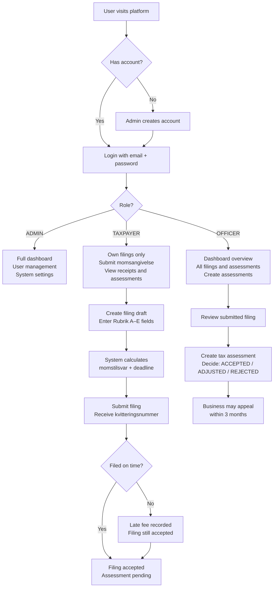
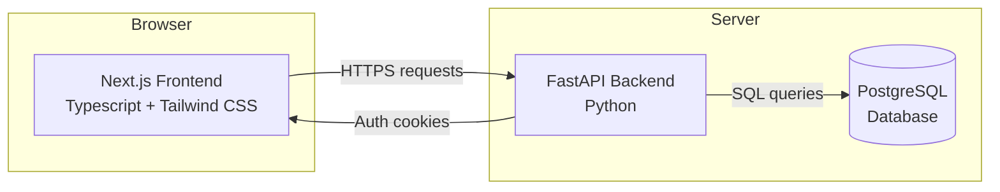
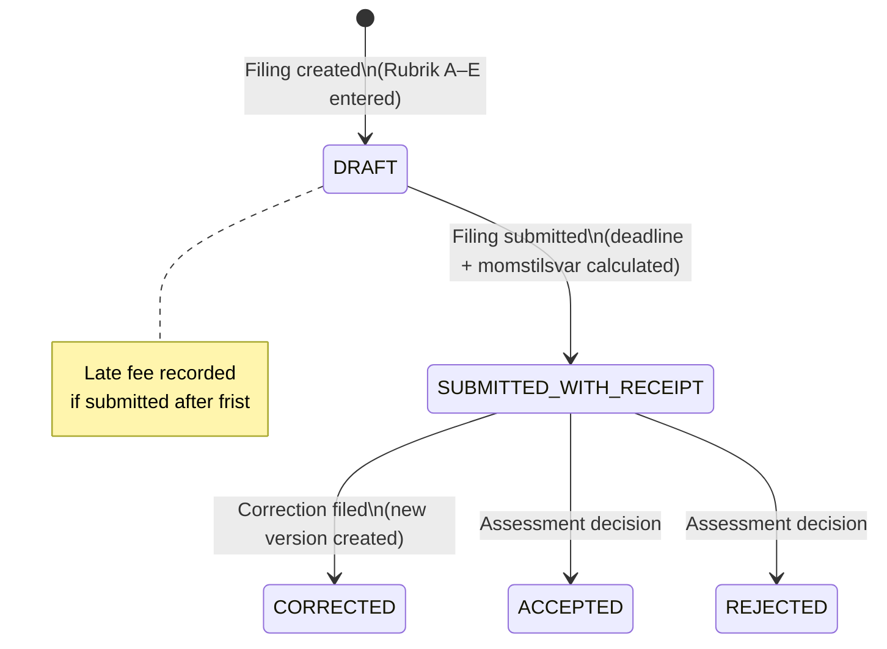
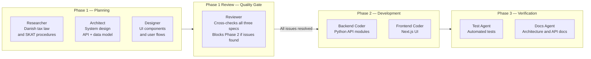

# Danish Tax Administration Platform — Project Overview

**Document type:** Project overview for product and project managers
**Last updated:** February 2026
**Status:** Phase 1 (planning and design) complete — Phase 2 (development) pending

---

## Contents

1. [Executive Summary](#1-executive-summary)
2. [Background and Problem Statement](#2-background-and-problem-statement)
3. [Who Uses the Platform](#3-who-uses-the-platform)
4. [What the Platform Does](#4-what-the-platform-does)
5. [How the Platform is Structured](#5-how-the-platform-is-structured)
6. [Key Business Rules](#6-key-business-rules)
7. [Technology Choices](#7-technology-choices)
8. [Part 2 — Build Strategy: Multi-Agent AI Development](#8-build-strategy-multi-agent-ai-development)
9. [Project Status and Next Steps](#9-project-status-and-next-steps)

---

## 1. Executive Summary

This project is a **web-based administration platform for Danish VAT (moms) filing**. It allows businesses to register for VAT, submit periodic VAT returns (momsangivelser), and receive assessments — all through a structured, rules-driven interface that reflects real Danish tax law as administered by SKAT.

The platform is built as an internal tool with three user types: **tax officers**, **administrators**, and **taxpayers** (businesses). It enforces Danish VAT law automatically — calculating payment amounts, filing deadlines, and late penalties — so that officers and businesses do not need to perform these calculations manually.

The project is being developed using a **multi-agent AI build strategy**, in which specialised AI agents handle research, design, architecture, coding, testing, and documentation in a structured, phased sequence.

---

## 2. Background and Problem Statement

### Danish VAT in brief

Every business in Denmark with annual turnover above DKK 50,000 must register for VAT (moms) and submit periodic VAT returns to SKAT (Skattestyrelsen). A VAT return — called a **momsangivelse** — reports:

- Output VAT collected from customers (Rubrik A)
- Input VAT paid on business purchases (Rubrik B)
- VAT on EU acquisitions and imports (Rubrik C and E)

The difference between these figures is the **momstilsvar**: the net amount owed to SKAT (or refunded by SKAT).

Businesses file these returns monthly, quarterly, or semi-annually depending on their turnover. Missing a deadline incurs a fixed fee (currently DKK 800 per period). Incorrect filings can be corrected within a 3-year window.

### What the platform solves

Managing this process — across many businesses, multiple filing periods, and complex deadline rules — is administratively intensive. This platform provides:

- A **structured digital filing workflow** that guides users through the momsangivelse correctly
- **Automatic calculation** of filing deadlines, payment amounts, and late penalties
- A **central record** of all registrations, filings, and tax assessments
- **Role-based access** so officers see all businesses, while individual businesses only see their own data
- An **audit trail** of every action taken

---

## 3. Who Uses the Platform

The platform has three user roles:

| Role | Who they are | What they can do |
|------|-------------|-----------------|
| **ADMIN** | Platform administrators | Full access: manage user accounts, configure system settings, view all data |
| **OFFICER** | Tax officers (SKAT staff) | Review filings from all businesses, create tax assessments, view all parties |
| **TAXPAYER** | Businesses / individuals | View and manage their own filings only — no access to other parties' data |

### User journey overview



---

## 4. What the Platform Does

The platform is organised into **four functional modules**, each corresponding to a stage in the Danish VAT administration lifecycle.

### Module 1 — Registration

Businesses are registered on the platform as **parties**. Each party has:

- A **CVR number** (8-digit company registration number from Erhvervsstyrelsen)
- One or more **SE numbers** (8-digit tax numbers from SKAT)
- A **filing period type** (monthly, quarterly, or semi-annual)
- A **VAT registration status** (active or inactive)

Officers and admins can register new parties, view party details, and assign roles to users.

### Module 2 — Authentication and Access Control

Users log in with an email address and password. The system issues secure session tokens stored in the browser. Access to every page and every data record is controlled by the user's role:

- An officer trying to create a new user account is blocked
- A taxpayer trying to view another business's filings receives a "not found" response (not a "permission denied" — this prevents fishing for other parties' data)

### Module 3 — VAT Filing (Momsangivelse)

The filing module is the core of the platform. A taxpayer or officer can:

1. **Create a filing draft** for a specific SE number and filing period
2. **Enter the canonical VAT fields** (Rubrik A through E) and turnover figures
3. The system **automatically calculates** the momstilsvar (net VAT payable)
4. The system **calculates the legal deadline** (frist) based on the filing period type, adjusting for weekends and bank holidays
5. **Submit the filing** — the system records a receipt number (kvitteringsnummer) and timestamps the submission
6. If submitted late, the system records the number of days overdue and the applicable late fee

A submitted filing can be **corrected** within 3 years if errors are found. Corrections create a new filing version linked to the original.

### Module 4 — Tax Assessment

After a filing is submitted, a tax officer can create a **tax assessment** (skatteansættelse). The assessment:

- Reviews the submitted VAT figures
- Records a decision: ACCEPTED, ADJUSTED, or REJECTED
- Specifies any additional tax due, surcharges, or interest
- Sets a payment deadline and an appeal deadline

The taxpayer can **appeal** the assessment within 3 months of the decision.

### Module 5 — Admin Dashboard

A summary dashboard visible to admins and officers shows:

- Total registered businesses
- Pending filings awaiting submission
- Submitted filings awaiting assessment
- Open assessments
- Overdue filings (submitted after deadline)

---

## 5. How the Platform is Structured

### Application architecture

The platform is a standard two-tier web application:

- A **frontend** (the user-facing website) built with Next.js and TypeScript
- A **backend API** (the business logic and data layer) built with Python and FastAPI
- A **PostgreSQL database** storing all records



### Backend module structure

Each functional module follows the same layered pattern internally. From top to bottom:

```
HTTP Request
    ↓
Router       — receives the request, checks authentication
    ↓
Service      — applies business rules (deadlines, calculations, validation)
    ↓
Repository   — reads from and writes to the database
    ↓
Database     — PostgreSQL tables
```

Modules communicate with each other through a **domain event system** — for example, when a filing is submitted, the Filing module publishes a "FilingSubmitted" event that the Assessment module listens for. This keeps modules independent of each other.

### Database tables

| Table | What it stores |
|-------|---------------|
| `parties` | Registered businesses (CVR, SE numbers, filing period type) |
| `users` | Platform accounts (role, linked party for TAXPAYER users) |
| `filings` | VAT returns (Rubrik A–E fields, deadlines, receipts, status) |
| `tax_assessments` | Assessment decisions (outcome, amounts, deadlines) |
| `vat_policies` | Configurable rules (late filing fee amount, bank holidays) |
| `admin_settings` | System-wide configuration key-value pairs |
| `audit_log` | Append-only record of every write operation |

### Filing status lifecycle



---

## 6. Key Business Rules

These are the rules the system enforces automatically, derived from Danish tax law:

| Rule | What it means in practice |
|------|--------------------------|
| **momstilsvar = A + C + E − B** | The net VAT amount is calculated from the five canonical Rubrik fields. The system computes this — users do not enter it directly. |
| **Filing deadlines are statutory** | Monthly filers: 25th of following month. Quarterly: 10th of second month after quarter end. Semi-annual: 1 Sep and 1 Mar. All adjusted for bank holidays. |
| **Late filings are accepted, not blocked** | A filing submitted after its deadline is still processed. The number of late days and the applicable fee (DKK 800) are recorded automatically. |
| **One canonical filing per period** | A business can only have one active (non-correction) filing per SE number + period. The database enforces this. |
| **Corrections link to originals** | A corrected filing retains a link to the filing it replaces. The original is marked CORRECTED; the new version is the active record. |
| **3-year reassessment window** | Officers can create assessments on any filing submitted within the past 3 years. |
| **3-month appeal window** | A taxpayer can appeal an assessment decision within 3 months of the decision date. |
| **Ownership is enforced at the API layer** | A taxpayer user can never retrieve another business's data, regardless of how requests are constructed. |
| **No hardcoded fees** | The late filing fee and interest rates are stored in a configurable database table (`vat_policies`), not in the code. Updating rates does not require a code deployment. |

---

## 7. Technology Choices

This section summarises the main technology decisions in plain terms.

| Concern | Choice | Why |
|---------|--------|-----|
| Frontend framework | Next.js (React) | Industry standard for modern web UIs; supports server-side rendering for fast initial page loads |
| Backend framework | FastAPI (Python) | Fast, type-safe, generates API documentation automatically |
| Database | PostgreSQL | Reliable, well-supported relational database; handles financial data correctly |
| Authentication | JWT tokens in secure cookies | Tokens cannot be read by JavaScript in the browser, reducing security risk |
| Styling | Tailwind CSS | Utility-first CSS framework; consistent with the SKAT/Danish government design system |
| Event system | Internal event bus | Modules notify each other through events rather than direct calls, keeping them loosely coupled and independently testable |

---

## 8. Build Strategy: Multi-Agent AI Development

The platform is being developed using a structured **multi-agent AI approach**. Rather than a single AI assistant handling all work, the process is divided into specialised agents — each with a defined role, defined inputs, and a defined output. No agent starts work until its inputs are ready.

### Why this approach

Breaking development into specialised agents produces better outcomes than a general approach:
- A **Researcher** agent focuses exclusively on getting Danish tax law right
- An **Architect** agent focuses on system design without being distracted by domain law
- A **Reviewer** agent acts as a quality gate — it interrogates the other agents' work critically before any code is written
- **Coder** agents build exactly what the specs say, without making design decisions

### Phase overview



### Agent roles

| Agent | Phase | What it does |
|-------|-------|-------------|
| **Researcher** | 1 | Reads Danish tax law and SKAT documentation. Identifies required fields, deadlines, and terminology. Reviews the Architect's and Designer's outputs for legal accuracy. |
| **Architect** | 1 | Designs the system: data models, API endpoints, authentication, event flows. Produces the technical specification all Coder agents build from. |
| **Designer** | 1 | Defines the UI: pages, components, design tokens (colours, typography), and user flows for each role. Grounds the design in the SKAT/government visual style. |
| **Reviewer** | 1 Review | Reads all three Phase 1 outputs critically. Checks that specs are consistent with each other, that domain knowledge is applied correctly, and that every decision is justified. **Phase 2 does not start until all blocking issues are resolved.** |
| **Backend Coder** | 2 | Implements the Python API: all new modules (Auth, Filing, Assessment, Dashboard, Admin), migrations, and event handlers. |
| **Frontend Coder** | 2 | Implements the Next.js UI: all pages, components, and typed API client. |
| **Test Agent** | 3 | Writes automated integration tests for every endpoint, business rule, and auth flow. |
| **Docs Agent** | 3 | Updates architecture documentation and generates the API reference. |

### Rules that apply across all agents

- No agent modifies another agent's output files
- No agent skips the Reviewer's findings — all Phase 2+ agents must read and incorporate the review
- Modules never call each other's internal services directly — all cross-module communication goes through the event bus
- Agents do not add features or abstractions beyond their defined scope

---

## 9. Project Status and Next Steps

### Current status

| Phase | Status | Notes |
|-------|--------|-------|
| Phase 1 — Research, architecture, design | **Complete** | All three spec files produced |
| Phase 1 Review | **Complete** | 5 blocking issues identified and resolved |
| Spec updates (post-review) | **Complete** | All Reviewer blockers addressed in `AGENT_ARCHITECT_SPEC.md` |
| Phase 2 — Backend and frontend development | **Pending** | Ready to start |
| Phase 3 — Testing and documentation | **Not started** | Depends on Phase 2 |

### Key deliverables expected from Phase 2

By the end of Phase 2, the following will exist as working code:

- A complete Python/FastAPI backend with all modules (Auth, Filing, Assessment, Dashboard, Admin)
- A complete Next.js frontend with all pages and components
- Database migrations for all tables
- A running application that can be started locally

### Phase 2 scope boundary

The following are **explicitly out of scope for Phase 2** and documented as Phase 3 concerns:

- Agterskrivelse (formal warning notice) workflow
- SKAT API integration for external receipt numbers
- Durable event broker (RabbitMQ/Kafka) replacing the in-memory event bus
- Server-side JWT token revocation
- Officer reassignment on assessments
- Automated provisional assessment creation for late filings

---

## Reference: Key Danish Terms

| Term | Meaning |
|------|---------|
| Momsangivelse | VAT return / VAT filing |
| Momstilsvar | Net VAT amount (payable or refundable) |
| Moms | VAT (Value Added Tax) |
| CVR-nummer | 8-digit Danish company registration number |
| SE-nummer | 8-digit tax registration number (one company may have several) |
| Afregningsperiode | The filing period type (monthly, quarterly, semi-annual) |
| Frist | Filing deadline |
| Korrektionsangivelse | Correction filing |
| Kvitteringsnummer | Receipt number issued upon successful submission |
| Skatteansættelse | Tax assessment |
| SKAT / Skattestyrelsen | The Danish Tax Authority |
| Erhvervsstyrelsen | The Danish Business Authority (issues CVR numbers) |
| Momsloven | The Danish VAT Act |
| Opkrævningsloven | The Danish Collection Act (governs late fees and penalties) |
